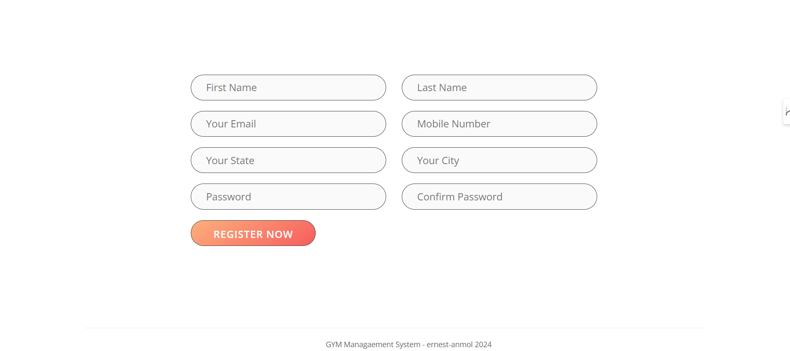

# GYM  Management System Project 
### GYM  Management System Project Using PHP and MySQL

How to run the GYM  Management System Project Using PHP and MySQL  Project

1. Download the GYM  Management System Project zip file

2. Extract the file and copy gym folder

3. Paste inside root directory(for xampp xampp/htdocs, for wamp wamp/www, for lamp var/www/html)

4. Open PHPMyAdmin (http://localhost/phpmyadmin)

5. Create a database with name: `gym_codecampbd`

6. Import `gym_codecampbd.sql` file(given inside the zip package in SQL file folder)

7. Go to Project File - > `http://localhost/"Your_Project_Name"`

### Database Name
- `ccbd_medipos`

### Preview

 - Admin Deshbord
    

    
    
    
    
